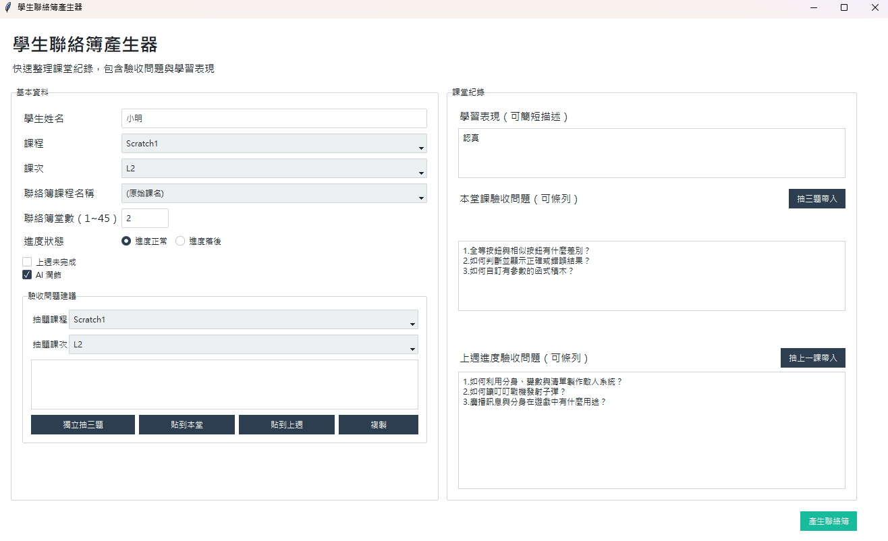
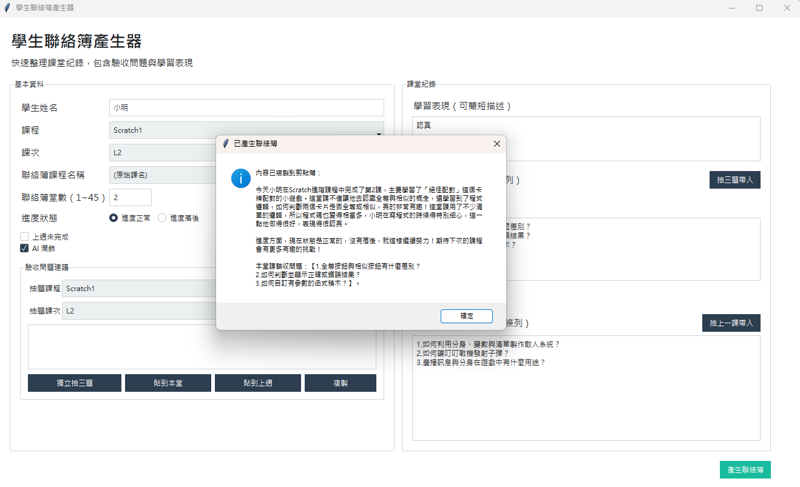

# OrangeAppleAssistant

## 應用程式介面


快速整理課堂紀錄、產生聯絡簿內容的小工具。可輸入學習表現與驗收問題，並選擇 AI 潤飾。

**重點功能**
- 產生聯絡簿文字（不條列，文章格式）
- 可勾選「上週未完成」並記錄上週驗收問題
- 可從題庫隨機抽 3 題帶入本堂課或上週驗收問題
- 提供獨立抽題區，可先選課程與課次，再貼到指定問題欄或複製
- 本堂課驗收問題必定出現
- 一鍵複製到剪貼簿
- 可選擇 AI 潤飾（OpenAI API）

## 介面功能（可填寫 / 下拉選單）
- 學生姓名：手動輸入
- 課程：下拉選單（對應資料庫課程）
- 課次：下拉選單（用來帶出該堂課內容）
- 聯絡簿課程名稱：下拉選單（可自訂顯示為線上菁英初階/中階/高階或原始課名）
- 聯絡簿堂數：手動輸入（1~45，可與課次同步）
- 進度狀態：單選（進度正常/進度落後）
- 上週未完成：勾選後可填上週驗收問題，並在聯絡簿開頭顯示
- 學習表現：多行輸入
- 本堂課驗收問題：多行輸入（一定會被寫入輸出）
- 抽三題帶入：依目前課程與課次，從 `question_bank.json` 隨機抽 3 題
- 上週抽上一課帶入：依目前課程，自動抓上一課題庫抽 3 題
- 驗收問題建議：可獨立選課程與課次抽題，並貼到本堂課或上週欄位
- AI 潤飾：勾選後使用 OpenAI 生成文字

## 環境需求
- Python 3.10+
- OpenAI API Key（寫在 `config.json`）

`config.json` 請放在專案根目錄（與 `main.py` 同層），打包時會一併內嵌。

`config.json` 範例：
```json
{
  "openai_api_key": "your-openai-api-key"
}
```

## 安裝與啟動
1. 建立虛擬環境
```bash
python -m venv venv
venv\Scripts\activate #Winsows
source venv/bin/activate #Mac
```

2. 安裝套件
```bash
pip install -r requirements.txt
```

3. 執行
```bash
python main.py
```

## 更新課程資料（db.py）
課程資料都集中在 `db.py`，每個課程是一個清單（list）。

**修改步驟**
1. 開啟 `db.py`
2. 找到對應課程清單（例如 `HTML`、`Python`、`JavaScript`）
3. 每個項目代表一堂課的內容描述，請依序增減或修改文字

**範例**
```python
HTML = [
    "「我的個人網站(1)」，介紹基礎排版與標籤。",
    "「我的個人網站(2)」，介紹圖片與超連結。",
]
```

注意：
- 課程清單的「順序」會影響 UI 的課次選擇結果
- 若課次數量變更，UI 的課次下拉選單需要同步調整
  - 在 `ui_components.py` 中找到 `values=[f"L{i}" for i in range(1, 16)]`
  - 把 `16` 改成新的最大堂數 + 1

## 更新驗收問題題庫（question_bank.json）
題庫集中在 `question_bank.json`，格式是「課程 -> 課次 -> 題目清單」。每一課建議至少放 3 題，抽題功能會自動隨機抽 3 題並格式化成：

```text
1.題目
2.題目
3.題目
```

範例：
```json
{
  "Python": {
    "L1": [
      "請說明變數的用途是什麼？",
      "請舉例說明字串和數字的差異。",
      "今天的作品中哪一段程式最關鍵？"
    ]
  }
}
```

注意：
- 課程代碼需對應 UI 下拉選單，例如 `Scratch1`、`Python`、`JavaScript_New`
- 課次需使用 `L1`、`L2` 這種格式
- 題目可以放 3 題以上，按鈕每次會隨機抽 3 題

## Docker 啟動
本專案已提供 `Dockerfile`。因為這是 Tkinter 桌面視窗程式，Docker 執行時需要主機端可接收 GUI 顯示。

建置映像檔：
```bash
docker build -t orange-apple-assistant .
```

Linux / WSL X11 範例：
```bash
docker run --rm \
  -e DISPLAY=$DISPLAY \
  -e OPENAI_API_KEY=your-openai-api-key \
  -v /tmp/.X11-unix:/tmp/.X11-unix \
  -v "$(pwd)/question_bank.json:/app/question_bank.json" \
  orange-apple-assistant
```

Windows 搭配 VcXsrv / X410 類工具範例：
```bash
docker run --rm ^
  -e DISPLAY=host.docker.internal:0 ^
  -e OPENAI_API_KEY=your-openai-api-key ^
  -v "%cd%/question_bank.json:/app/question_bank.json" ^
  orange-apple-assistant
```

也可以不使用 `OPENAI_API_KEY`，改成掛載 `config.json` 到 `/app/config.json`。

## 打包成 Windows APP（EXE）
本專案已提供 `main.spec`，會自動把 `config.json` 與 `question_bank.json` 打包進去。

```bash
pyinstaller main.spec
```

完成後：
- 產出位置：`dist\main\main.exe`

## 打包成 macOS APP
macOS 需要在 macOS 環境執行打包（Windows 無法直接產出 macOS App）。

1. 在 macOS 安裝依賴
```bash
python3 -m venv venv
source venv/bin/activate
pip install -r requirements.txt
pip install pyinstaller
```

2. 直接打包
```bash
pyinstaller main.py --noconsole --name OrangeAppleAssistant --add-data "config.json:."
```

完成後：
- 產出位置：`dist/OrangeAppleAssistant.app`

## 專案結構
- `main.py` 入口流程與聯絡簿產生
- `ui_components.py` UI 佈局與元件
- `helpers.py` OpenAI API 與課程名稱對應
- `db.py` 課程內容資料
- `question_bank.py` 題庫讀取、抽題與格式化
- `question_bank.json` 每課驗收問題題庫
- `Dockerfile` Docker 執行環境
- `config.json` API Key（可打包進執行檔）
- `main.spec` PyInstaller 設定
